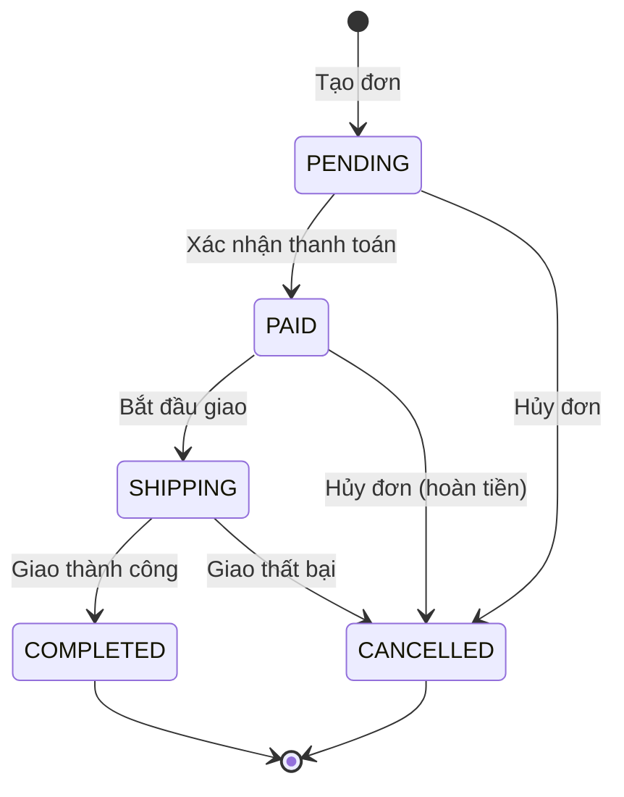

### 2.1 Cấu trúc thư mục chuẩn

```
BE/
├── pom.xml
├── src/
│   ├── main/
│   │   ├── java/com/ecommerce/
│   │   │   ├── EcommerceApplication.java          # Main entry point
│   │   │   │
│   │   │   ├── config/
│   │   │   │   ├── TiKVConfig.java                # TiSession bean, PD endpoint
│   │   │   │   └── CorsConfig.java                # CORS configuration
│   │   │   │
│   │   │   ├── controller/
│   │   │   │   └── OrderController.java           # REST endpoints /api/orders
│   │   │   │
│   │   │   ├── service/
│   │   │   │   ├── OrderService.java              # Business logic interface
│   │   │   │   └── OrderServiceImpl.java          # Implementation with 2PC
│   │   │   │
│   │   │   ├── repository/
│   │   │   │   ├── TiKVRepository.java            # Generic KV operations
│   │   │   │   └── OrderRepository.java           # Order-specific KV operations
│   │   │   │
│   │   │   ├── model/
│   │   │   │   ├── Order.java                     # Order entity (POJO)
│   │   │   │   ├── OrderStatus.java               # Enum: PENDING, PAID, etc.
│   │   │   │   └── dto/
│   │   │   │       ├── CreateOrderRequest.java    # Request DTO
│   │   │   │       ├── UpdateStatusRequest.java   # Status transition DTO
│   │   │   │       └── OrderResponse.java         # Response DTO
│   │   │   │
│   │   │   └── exception/
│   │   │       ├── GlobalExceptionHandler.java    # @ControllerAdvice
│   │   │       ├── OrderNotFoundException.java
│   │   │       └── InvalidStatusTransitionException.java
│   │   │
│   │   └── resources/
│   │       └── application.yml                    # PD address, app config
│   │
│   └── test/
│       └── java/com/ecommerce/
│           ├── controller/OrderControllerTest.java
│           ├── service/OrderServiceTest.java
│           └── repository/OrderRepositoryTest.java
```

### 2.2 Chi tiết Endpoints (dựa trên FR-01 → FR-03)

#### 2.2.1 FR-01: Khởi tạo đơn hàng

| Thuộc tính | Giá trị |
|---|---|
| **Method** | `POST` |
| **URL** | `/api/orders` |
| **Description** | Tạo đơn hàng mới, ghi vào TiKV với key = `order:{order_id}` |
| **Request Body** | `CreateOrderRequest` |
| **Response** | `201 Created` — `OrderResponse` |
| **TiKV Key** | `order:{UUID}` |

**Request Body:**

```json
{
  "customerName": "Nguyen Van A",
  "items": [
    { "productId": "PROD-001", "name": "Laptop Dell XPS", "quantity": 1, "price": 25000000 }
  ],
  "totalAmount": 25000000,
  "shippingAddress": "123 Nguyen Hue, Q1, HCM"
}
```

**Response (201):**

```json
{
  "success": true,
  "data": {
    "orderId": "ORD-a1b2c3d4",
    "customerName": "Nguyen Van A",
    "items": [
      { "productId": "PROD-001", "name": "Laptop Dell XPS", "quantity": 1, "price": 25000000 }
    ],
    "totalAmount": 25000000,
    "status": "PENDING",
    "createdAt": "2026-09-01T10:30:00Z",
    "updatedAt": "2026-09-01T10:30:00Z"
  },
  "message": "Order created successfully"
}
```

#### 2.2.2 FR-02: Cập nhật trạng thái giao dịch (2PC)

| Thuộc tính | Giá trị |
|---|---|
| **Method** | `PATCH` |
| **URL** | `/api/orders/{orderId}/status` |
| **Description** | Cập nhật trạng thái đơn hàng sử dụng giao dịch 2PC nguyên tử |
| **Request Body** | `UpdateStatusRequest` |
| **Response** | `200 OK` — `OrderResponse` |

**State Machine — Chuyển trạng thái hợp lệ:**



**Request Body:**

```json
{
  "newStatus": "PAID",
  "reason": "Payment confirmed via bank transfer"
}
```

**Response (200):**

```json
{
  "success": true,
  "data": {
    "orderId": "ORD-a1b2c3d4",
    "status": "PAID",
    "previousStatus": "PENDING",
    "updatedAt": "2026-09-01T10:35:00Z"
  },
  "message": "Order status updated: PENDING → PAID"
}
```

**Error Response (400) — Invalid Transition:**

```json
{
  "success": false,
  "error": {
    "code": "INVALID_STATUS_TRANSITION",
    "message": "Cannot transition from COMPLETED to PENDING"
  }
}
```

#### 2.2.3 FR-03: Truy vấn đơn hàng

**Endpoint A — Truy vấn theo ID:**

| Thuộc tính | Giá trị |
|---|---|
| **Method** | `GET` |
| **URL** | `/api/orders/{orderId}` |
| **Description** | Lấy chi tiết đơn hàng theo `orderId` |
| **Response** | `200 OK` — `OrderResponse` |

**Endpoint B — Scan toàn bộ đơn hàng (Range Scan):**

| Thuộc tính | Giá trị |
|---|---|
| **Method** | `GET` |
| **URL** | `/api/orders` |
| **Description** | Duyệt danh sách đơn hàng bằng TiKV Key Range Scan |
| **Query Params** | `?status=PENDING&limit=50&cursor=order:xxx` |
| **Response** | `200 OK` — `{ data: OrderResponse[], cursor: string, hasMore: boolean }` |

**Response (200) — List:**

```json
{
  "success": true,
  "data": [
    { "orderId": "ORD-001", "status": "PENDING", "totalAmount": 500000 },
    { "orderId": "ORD-002", "status": "PAID", "totalAmount": 1200000 }
  ],
  "pagination": {
    "cursor": "order:ORD-002",
    "hasMore": true,
    "limit": 50
  }
}
```

#### 2.2.4 Bảng tổng hợp tất cả Endpoints

| # | Method | URL | Mô tả | FR |
|---|---|---|---|---|
| 1 | `POST` | `/api/orders` | Tạo đơn hàng mới | FR-01 |
| 2 | `GET` | `/api/orders/{orderId}` | Lấy chi tiết đơn hàng | FR-03 |
| 3 | `GET` | `/api/orders` | Danh sách đơn hàng (scan range) | FR-03 |
| 4 | `PATCH` | `/api/orders/{orderId}/status` | Cập nhật trạng thái (2PC) | FR-02 |
| 5 | `DELETE` | `/api/orders/{orderId}` | Xóa đơn hàng (soft delete → CANCELLED) | FR-02 |
| 6 | `GET` | `/api/orders/stats` | Thống kê số đơn theo trạng thái | Dashboard |
| 7 | `GET` | `/api/health` | Health check kết nối TiKV | Ops |

